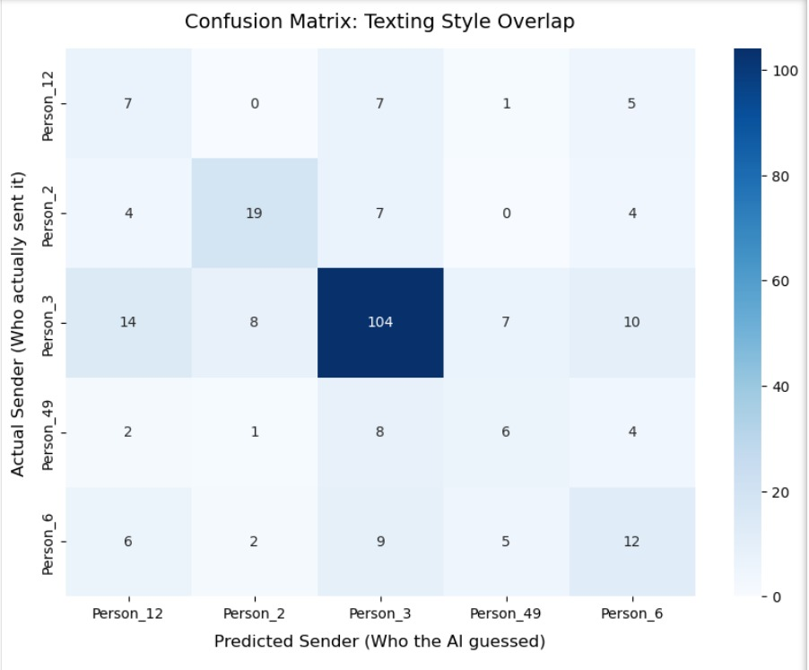

# 📱 WhatsApp Chat Analyzer & NLP Classifier

**Academic Title:** Predictive Text Analysis on Unstructured Chat Data

[](https://srinidhi-g25-nlp-chat-analyzer-app-ibhxi1.streamlit.app/) 

This project is an end-to-end Machine Learning pipeline that securely ingests proprietary, multi-party conversational text, sanitizes it of sensitive identifiers, and accurately classifies the authorship of anonymous messages based purely on stylometric features (vocabulary, syntax, and phrasing).

## 🚀 System Architecture

This project is decoupled into two distinct modules—Data Engineering and Model Inference—to ensure scalability, separation of concerns, and strict adherence to data privacy standards.

* **`parser.py` (ETL & Data Engineering Pipeline):** A standalone ingestion script that processes raw, unstructured WhatsApp `.txt` exports. It utilizes a custom Regex engine with a multi-tier logical check to sanitize invisible Unicode markers (`\u200e`, `\u202f`) and filter system-generated noise. To ensure zero data leakage, real identities are dynamically anonymized entirely in RAM prior to Pandas DataFrame structuring.
* **`app.py` (Live Inference Engine):** The edge-deployable UI script. Built with Streamlit, it hosts a local web server for real-time text classification. It operates strictly on frozen, serialized `.pkl` models (TF-IDF Vectorizer and Logistic Regression classifier), completely isolating the end-user interface from the raw training data.

## 🛠️ Key Engineering Highlights

* **Privacy-First Data Sanitization:** Engineered a dynamic, in-memory anonymization pipeline that maps real identities to generic identifiers (e.g., `Person_1`) on the fly, guaranteeing zero persistence of sensitive user data.
* **Algorithmic PII Leakage Mitigation:** Identified a data leakage vulnerability where the model memorized real names as predictive features. Engineered custom NLP stop-word thresholds to permanently scrub Personally Identifiable Information (PII) from the feature space, forcing the algorithm to learn genuine stylometric and syntactic patterns.
* **Class Imbalance Optimization:** Mitigated a severe class imbalance (where a single user accounted for ~56% of the dataset) by upgrading the baseline Naive Bayes model to a `LogisticRegression` classifier utilizing `class_weight='balanced'`. This penalized majority-class overfitting and successfully mapped distinct features for quieter group members.
* **End-to-End Deployment:** Bridged the gap between Jupyter Notebook experimentation and real-world application by engineering a live Streamlit UI (`app.py`), enabling real-time, on-the-fly multiclass probability scoring from user input.

## 🧠 Visualizing the AI's Brain

To prove the model learned distinct linguistic profiles rather than just memorizing data, we extracted the "Top 10 Signature Words" (mathematical TF-IDF weights) for each user. Furthermore, a **Confusion Matrix Heatmap** was generated to visually diagnose mathematically similar texting styles within the group.

 


## 💻 Tech Stack
* **Language:** Python
* **Data Engineering:** `pandas`, `re` (Regular Expressions)
* **Machine Learning & NLP:** `scikit-learn` (`TfidfVectorizer`, `LogisticRegression`)
* **Serialization:** `joblib`
* **Frontend UI:** `streamlit`
* **Data Visualization:** `seaborn`, `matplotlib`

## ⚙️ How to Run the Live Web App

The model has already been trained and serialized into `.pkl` files. To run the live inference engine locally:

1. Clone this repository to your local machine.
2. Ensure you have the required libraries installed (`pip install pandas scikit-learn streamlit joblib`).
3. Navigate to the project folder in your terminal.
4. Launch the Streamlit server by running:
   ```bash
   streamlit run app.py
